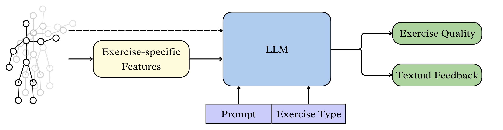

# ExerciseLLM
[ARIAL@IJCAI2025] Python code and dataset repository for paper "Rehabilitation Exercise Quality Assessment and Feedback Generation Using Large Language Models with Prompt Engineering"

[[ArXiv Paper]](https://arxiv.org/abs/2505.18412v1) 

Pipeline Diagram:


## Table of Content
* [1. Installation](#1-installation)
* [2. Datasets](#2-datasets)
* [3. Visualization](#3-visualization)
* [4. Acknowledgements](#4-acknowledgements)
* [Citation](#citation)
 
## 1. Installation

### 2.1. Environment
create a virtual env to install the requirements:
```bash
pip install -r requirements.txt
```

## 2. Datasets

### 2.1 Download Datasets
**ExerciseLLM** is a categorized and described rehabilitation exercise movement dataset that originates from [UI-PRMD](https://webpages.uidaho.edu/ui-prmd/) and [IRDS](https://zenodo.org/records/13305826) dataset, which can be downloaded directly from the linked sites. 

For UI-PRMD, only the segmented files from Kinect are used. For REHAB24-6, only the `2d_joints_segmented` data are used.

Ensure the downloaded dataset follows the format below:
```
./dataset/
├── REHAB24-6
    ├── 2d_joints_segmented
        ├── Ex1-segmented
            ├── PM_000_c18_rightarm-1-rep1-1.npy
            ├── PM_000_c18_rightarm-1-rep2-1.npy
            ├── ...
            └── PM_122_c18_rightarm-7-rep10-0.npy 
        ├── Ex2-segmented/
        ...
        └── Ex6-segmented/
    └── annotations.csv
└── UI-PRMD
    ├── correct
        ├── kinect
            ├── angles/
            ├── positions
                ├── m01_s01_e01_positions.txt
                ├── m01_s01_e02_positions.txt
                ├── ...
                └── m10_s10_e10_positions.txt
    └── incorrect/
```

### 2.2 Generate Features
Run the following Python scripts to generate the exercise-specific features data.

**UI-PRMD**
`python generate_UIPRMD.py`

This will generate a 'features' and 'absolutes' folder under both `UI-PRMD/correct' and 'UI-PRMD/incorrect'

**REHAB24-6**
`python generate_REHAB24-6.py`


**The final data directory tree follows:**
```
./dataset/
├── REHAB24-6
    ├── 2d_joints_segmented
        ├── Ex1-segmented/
        ├── Ex2-segmented/
        ...
        └── Ex6-segmented/
        ├── features
            ├── Ex1-segmented/
                ├── PM_000_c18_rightarm-1-rep1-1_features.csv
                ...
                └──PM_122_c18_rightarm-7-rep10-0_features.csv
            ├── Ex2-segmented/
            ...
            └── Ex6-segmented/
    └── annotations.csv
└── UI-PRMD
    ├── correct
        ├── kinect
            ├── absolutes
                ├── m01_s01_e01_absolutes.csv
                ├── m01_s01_e02_absolutes.csv
                ├── ...
                └── m10_s10_e10_absolutes.csv
            ├── angles/
            ├── positions/
            └── features
                ├── m01_s01_e01_features.csv
                ├── m01_s01_e02_features.csv
                ├── ...
                └── m10_s10_e10_features.csv
    └── incorrect/
```

## 3. Visualization
Visualize UI-PRMD movements by running `UI-PRMD_visualization.ipynb`

## 4. Acknowledgements

This research was funded by the New Frontiers in Research Fund, Canada, and the TRANSFORM HF Undergraduate Summer Research Program, Canada.

Contributors are [Jessica Tang](mailto:jessicao.tang@mail.utoronto.ca), [Ali Abedi](ali.abedi@uhn.ca), [Tracey Colella](tracey.colella@uhn.ca), [Shehroz Khan](shehroz.khan@uhn.ca) at KITE Research Institute.

## Citation
